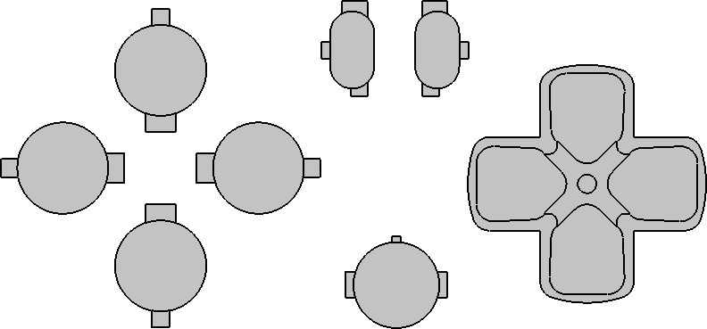
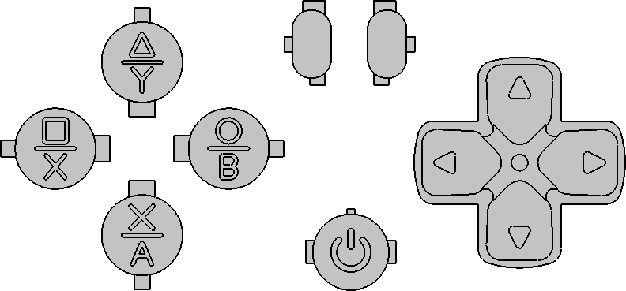

# DualShock 4 Buttons
Personal CAD files for DualShock 4 buttons  
  
#### Important note:
- Files provided here are provided "as is".
- Naming :
   - *-org.ext : based on aftermaket buttons.
   - *-mod.ext : modified version that allow custom making based in part on Xbox controller, Share/option button increased height by 1mm for easier use as retro controller.
   - Don't ask for modification on 'ps-org.XXX' as PS logo is a trademark of Sony.
  
#### Preview:
- Original :  

  
- Modification :  

- Real :  

  
#### Printing:
- I can only recommend you to try to print provided files on a SLA/MSLA printer.  
- Markings on buttons have a width of 0.45mm (0.8mm for PS button), this can be a problem with some resin as some crystals can form into theses marking because of the narrow dimensions (I got hard time printing theses using eSun Hard Tough (ABS Like) resin).  
  
#### "Painting":
On my buttons, I didn't really used paint but Epoxy colored with pigments (2 hours pot life). Using a thru hole resistor pin and a magnifying glass to fill each markings.  
